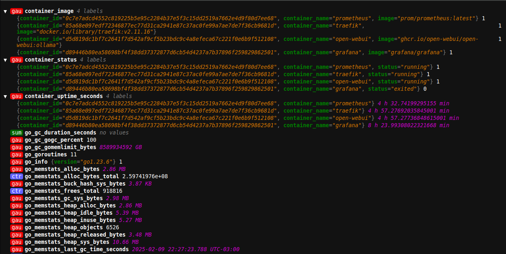

# Docker Exporter - Metrics for Prometheus

## Description
This project provides a Docker metrics exporter for Prometheus, written in Go. It allows monitoring various Docker container parameters such as uptime, status, and image, exposing them to Prometheus.

> **Frontend Interface**: Check out our web interface at [docker-export-webui](https://github.com/tarcisiomiranda/docker-export-webui.git)

<!--  -->


## Features
- **Container Uptime**: Measures the time since a container started.
- **Container Status**: Provides the current container status.
- **Container Image**: Shows the image used by the container.

## Go Requirements
To compile and run the Go version of the exporter:

```bash
go mod init docker_exporter
go mod tidy
```

## Installation and Usage (Go)
1. Compile the code: `CGO_ENABLED=0 GOOS=linux go build -a -installsuffix cgo -o docker_exporter .`
2. Run the binary: `./docker_exporter serve -p 9100`

## Endpoints
- `/metrics`: Returns current container metrics.

## Execution Modes - GO
- Development Mode: `go run ./docker_exporter.go`
- Production Mode: `./docker_exporter serve -p 9100`

## Installing GO binary on Linux

### Creating *Prometheus* user and setting permissions
```
useradd prometheus
usermod -aG docker prometheus
mkdir /opt/prometheus/docker_exporter/
chown -R prometheus:prometheus /opt/prometheus/docker_exporter/
```

Systemd service content
***/etc/systemd/system/docker_exporter.service***
```
[Unit]
Description=Docker Exporter
Wants=network-online.target
After=network-online.target

# Internal Restart
StartLimitIntervalSec=600
StartLimitBurst=5

[Service]
User=prometheus
WorkingDirectory=/opt/prometheus/docker_exporter
ExecStart=/opt/prometheus/docker_exporter/docker_exporter serve -p 9100
Restart=on-failure
RestartSec=5

[Install]
WantedBy=multi-user.target
```

Reload systemd, enable and start the exporter
```bash
systemctl daemon-reload
systemctl enable docker_exporter
systemctl start docker_exporter
```

View GO program logs
```bash
journalctl -u docker_exporter
```

## Creating .deb package

To create a .deb package for Docker Exporter, follow these steps:

1. First, install the necessary tools:
```bash
sudo apt-get install build-essential dh-make devscripts
```

2. Create the package directory structure:
```bash
mkdir -p docker-exporter_1.0.0/DEBIAN
mkdir -p docker-exporter_1.0.0/opt/prometheus/docker_exporter
mkdir -p docker-exporter_1.0.0/etc/systemd/system
```

3. Create the DEBIAN/control file:
```bash
cat > docker-exporter_1.0.0/DEBIAN/control << EOL
Package: docker-exporter
Version: 1.0.0
Section: utils
Priority: optional
Architecture: amd64
Depends: docker-ce | docker.io
Maintainer: Your Name <email>
Description: Docker Exporter for Prometheus
 Docker metrics exporter for Prometheus,
 allowing Docker container monitoring.
EOL
```

4. Compile the binary and copy necessary files:
```bash
# Compile the binary
CGO_ENABLED=0 GOOS=linux GOARCH=amd64 go build -a -installsuffix cgo -o docker-exporter_1.0.0/opt/prometheus/docker_exporter/docker_exporter

# Copy the systemd service file
cp /etc/systemd/system/docker_exporter.service docker-exporter_1.0.0/etc/systemd/system/
```

5. Create the .deb package:
```bash
dpkg-deb --build docker-exporter_1.0.0
```

6. Install the package:
```bash
sudo dpkg -i docker-exporter_1.0.0.deb
```

7. If needed, install missing dependencies:
```bash
sudo apt-get install -f
```

After installation, the service will be automatically configured and you can manage it with:
```bash
sudo systemctl start docker_exporter
sudo systemctl enable docker_exporter
sudo systemctl status docker_exporter
```

## Contributions
Contributions are welcome. Please open an issue or pull request to discuss proposed changes.

## License
This project is under the GNU General Public License (GPL), which is a free software license that ensures the freedom to share and modify all licensed software to ensure it remains free.

## Frontend
Currently, the frontend for this system is under development. For more information, you can check the [docker-export-webui](https://github.com/tarcisiomiranda/docker-export-webui.git) repository.
